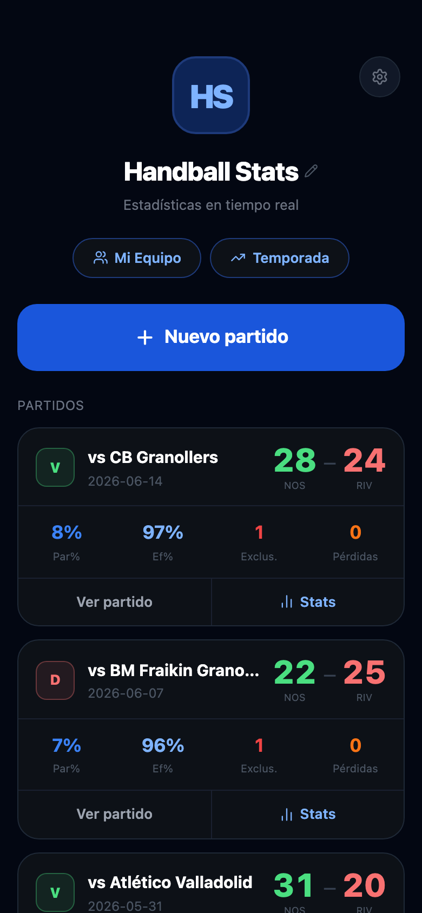
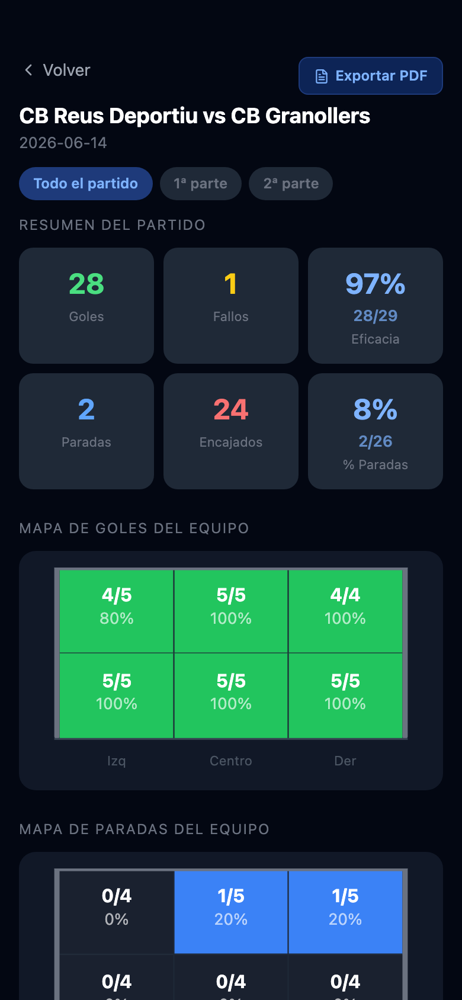
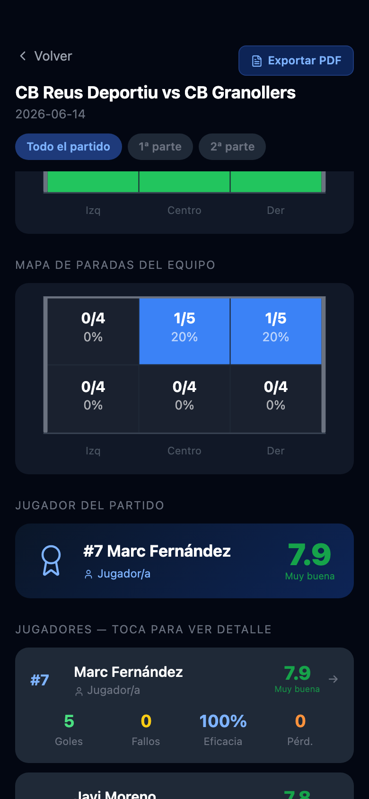
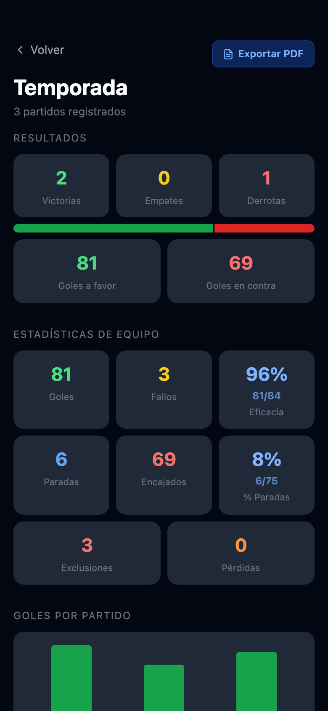
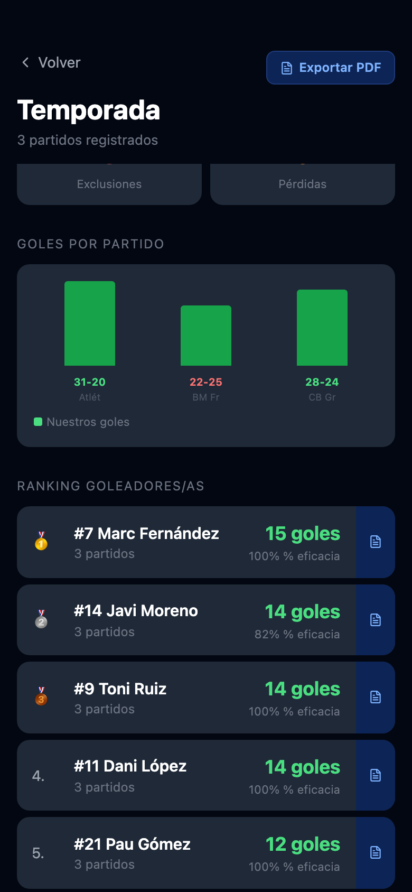
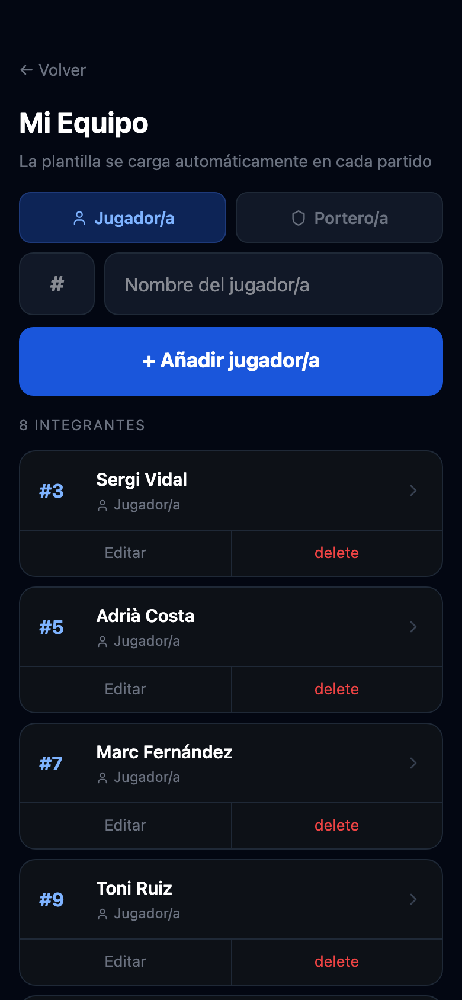

# Handball Stats

A real-time handball match tracking PWA built for coaches and analysts.

<div align="center">

[](https://handball-stats-sand.vercel.app)
[](https://handball-stats-sand.vercel.app)
[](https://react.dev)
[](LICENSE)

</div>

<div align="center">
<table>
<tr>
<td align="center"><br/><sub><b>Match list</b></sub></td>
<td align="center"><br/><sub><b>Post-match stats</b></sub></td>
<td align="center"><br/><sub><b>Heatmap & MVP</b></sub></td>
</tr>
<tr>
<td align="center"><br/><sub><b>Season dashboard</b></sub></td>
<td align="center"><br/><sub><b>Rankings & charts</b></sub></td>
<td align="center"><br/><sub><b>Squad management</b></sub></td>
</tr>
</table>
</div>

## Why this exists

Tracking handball stats during a live match is harder than it sounds.
Existing tools are either generic sports apps that don't understand handball,
or spreadsheets impossible to fill in fast enough while the game is happening.

I play handball, so I built the tool I actually wanted on the bench. Record events live, review per-player and team statistics, and export professional PDF reports — all from a mobile browser with no app install required.

---

## Features

### Live Match Tracking
- Real-time scoreboard with manual control of both team and rival score
- Timer with play/pause and manual minute adjustment
- First/second half toggle (switchable in both directions)
- One-tap event logging: Goal, Miss, Save, Conceded, Exclusion, Turnover
- Per-event detail capture: zone, shot type, miss reason, exclusion type, turnover type
- Undo last event and delete any individual event mid-match
- Match notes

### Post-Match Analysis
- Team summary: goals, misses, efficiency %, saves, save %
- Goal and save heatmap visualised on an SVG goal frame (6 zones: top/bottom × left/centre/right)
- MVP with automatic player rating (1–10) based on EHF Champions League baselines
- Full per-player breakdown: shooting efficiency by zone and shot type for field players; save % by zone and received shot type for goalkeepers
- Period-by-period filter (All / 1st half / 2nd half)
- Match timeline

### Season Dashboard
- Win/Draw/Loss record with visual result bar
- Aggregated team shooting and save stats
- Goals trend chart across all matches
- Top scorers ranking (goals + efficiency %)
- Top goalkeeper ranking (save %)
- Full match history — tap any match to open its stats directly

### Player Season View
- Individual player season summary accessible from both Squad and Season Dashboard
- Totals: goals, efficiency %, saves, save %, exclusions, turnovers
- Season-aggregated zone efficiency heatmap (SVG goal frame)
- Shot type breakdown chart
- Per-match history with individual stats
- PDF export for each player

### Squad Management
- Add, edit and delete players with number and name
- Role: field player or goalkeeper
- Tap any player to open their full season stats

### PDF Export
- Full match report: team summary, heatmaps, player table, MVP, timeline
- Individual player match report: zone efficiency map, shot type breakdown
- Season report: rankings, trend data, full match history
- Individual player season report

### Additional
- Google authentication + Firestore cloud sync
- Guest mode (local storage only)
- Editable profile name on home screen
- ES / EN language toggle
- Player ratings toggle (useful for youth teams)
- PWA — installable on iOS and Android

---

## Tech Stack

| Layer | Technology |
|---|---|
| Framework | React 19 + Vite |
| Styling | Tailwind CSS v4 + inline styles |
| Auth & sync | Firebase Authentication + Firestore |
| Icons | Lucide React |
| Deployment | Vercel |

---

## Getting Started

```bash
git clone https://github.com/Elitoq/handball-stats.git
cd handball-stats
npm install
npm run dev
```

### Firebase Setup

Create a project at [firebase.google.com](https://firebase.google.com), enable **Google Authentication** and **Firestore**, then add your config to `src/firebase.js`:

```js
import { initializeApp } from 'firebase/app'
import { getAuth } from 'firebase/auth'
import { getFirestore } from 'firebase/firestore'

const app = initializeApp({
  apiKey: '...',
  authDomain: '...',
  projectId: '...',
  storageBucket: '...',
  messagingSenderId: '...',
  appId: '...',
})

export const auth = getAuth(app)
export const db   = getFirestore(app)
```

The app works fully without Firebase in guest mode (data stored in localStorage).

---

## Project Structure

```
src/
├── components/
│   └── ActionModal.jsx        # Event detail capture modal (zone, shot type, etc.)
├── data/
│   └── store.js               # Data layer, stat calculations, player rating algorithm
├── pages/
│   ├── Home.jsx               # Match list, navigation, profile
│   ├── Login.jsx              # Google auth / guest entry
│   ├── MatchLive.jsx          # Live match tracking
│   ├── MatchSetup.jsx         # Match configuration and roster selection
│   ├── MatchStats.jsx         # Post-match statistics and player detail
│   ├── PlayerSeasonView.jsx   # Individual player season stats
│   ├── SeasonDashboard.jsx    # Season-wide aggregated stats
│   └── Squad.jsx              # Player roster management
├── reports/
│   └── generateReport.js      # PDF report generation (match, player, season)
├── i18n.js                    # ES / EN translations
├── firebase.js                # Firebase configuration
└── App.jsx                    # Routing and auth state
```

---

## Player Rating Algorithm

Ratings (1–10) are computed using EHF Champions League expected performance data, split by role:

**Field players** — weighted by shot difficulty: wing shots and 9m attempts are harder than fast breaks and 7m penalties. The score rewards efficiency above expected averages per shot type and penalises turnovers and exclusions.

**Goalkeepers** — compared against expected save % per received shot type, with bonuses for penalty saves and fast-break saves, and a volume bonus for high workload matches.

---

## Live Demo

[handball-stats-sand.vercel.app](https://handball-stats-sand.vercel.app)

---

## License

MIT — built by [Eliot](https://github.com/Elitoq)
